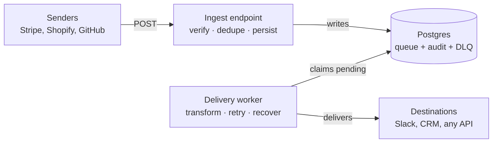

# Webhook Relay & Transformer

A reliable middleman for webhooks. It sits between webhook *senders* (Stripe, Shopify, GitHub) and your *destinations* (Slack, a CRM, an internal API), and guarantees that no event is ever silently lost — even when your destination is down, the same event arrives twice, or the relay itself crashes mid-delivery.

---

## The problem

Most teams wire webhook senders directly into their own systems. That works until it doesn't:

- **The destination is down for 30 seconds.** The webhook fires during those 30 seconds, the delivery fails, and the event is gone forever. A customer paid but never got their confirmation.
- **The sender retries and sends a duplicate.** Naive handlers process it twice — two confirmation emails, two records, a double refund.
- **The receiving process crashes halfway through.** Was the event delivered or not? Nobody knows, and there's no way to find out.

This relay solves all three by decoupling *receiving* from *delivering*. Incoming webhooks are persisted immediately and acknowledged in milliseconds; a separate worker delivers them asynchronously, retrying on failure, and never drops anything.

---

## Architecture



The ingest endpoint's only job is to authenticate, deduplicate, and write the event down — then say "got it" in a few milliseconds. It never calls the destination. A separate worker process reads the store and handles delivery. This separation is what makes the system reliable: a slow or dead destination can never block or lose an incoming webhook.

---

## Design decisions

These are the choices that matter, and the reasoning behind each.

### Postgres as the queue — not Redis or RabbitMQ

At realistic webhook volumes, a single Postgres table backed by `SELECT ... FOR UPDATE SKIP LOCKED` is a completely sufficient queue, and it collapses three concerns into one store: the pending queue, the audit log, and the dead-letter queue are all just rows with different `status` values. `SKIP LOCKED` lets multiple workers claim disjoint sets of events concurrently without ever grabbing the same row. The payoff is one fewer piece of infrastructure to deploy, monitor, and reason about — and no consistency gap between "the queue" and "the record of what happened."

### At-least-once delivery, and dedupe at the edge

Exactly-once delivery is effectively impossible in a distributed system: if a process can crash between "the HTTP call succeeded" and "I recorded that it succeeded," you must choose which failure you prefer. This relay chooses **at-least-once** — it would rather deliver twice than lose an event, because for webhooks a silent loss is the worse outcome. Duplicates are then absorbed at ingest by a unique constraint on `(source, external_id)`, enforced by the database itself so that even two duplicate webhooks arriving in the same millisecond can't both be stored.

### Crash recovery via lease expiry

When a worker claims an event it stamps `claimed_at` and sets status to `delivering` — think of it as a lease, not permanent ownership. If the worker dies mid-delivery (`kill -9`, power loss, OOM), no cleanup code runs and the row is stranded at `delivering`. A sweep at the top of each worker cycle finds any `delivering` row whose lease has expired (older than a timeout) and returns it to `pending`. This is the same "visibility timeout" pattern used by SQS, and it's what makes the system survive hard crashes rather than just graceful errors.

### Exponential backoff stored in the data

Retry timing lives in the row (`next_retry_at`, `attempts`), not in worker memory. A failed delivery schedules its next attempt (30s → 2min → 10min → 1hr) by writing a future timestamp; the claim query simply ignores events whose retry time hasn't arrived. Because the schedule is persisted, restarting the worker preserves all in-flight retry timing — nothing resets.

### Config-driven transformation

Senders and destinations speak different shapes. The relay reshapes payloads using JSON templates with `{{dotted.path}}` placeholders, resolved against the stored payload. Adding a new destination format is a new template file — not new code, not a redeploy. Templates preserve types for whole-value substitutions (a number stays a number) and degrade gracefully on missing fields rather than crashing.

---

## Reliability, demonstrated

Every failure mode has a corresponding behaviour you can trigger and watch:

| Failure | What happens |
|---|---|
| Destination down | Event retries with exponential backoff, then self-heals when the destination recovers — no intervention |
| Duplicate webhook | Rejected at ingest by the unique constraint; sender gets a calm `200`, no double delivery |
| Tampered payload | HMAC verification fails, request rejected with `401` |
| Worker crash mid-delivery | Event's lease expires and it's returned to the queue on the next cycle |
| Permanent failure | After max attempts, event moves to the dead-letter queue for inspection and manual replay |

---

## Admin API

| Method | Route | Purpose |
|---|---|---|
| `POST` | `/hooks/{source}` | Ingest a webhook (verify, dedupe, persist) |
| `GET` | `/events?status=failed` | List events, optionally filtered by status |
| `POST` | `/events/{id}/replay` | Return a failed event to the queue for redelivery |

Replay resets the event to a clean `pending` state and lets the existing worker do the rest — no separate redelivery path. It refuses to replay anything that isn't `failed` (returns `409`), preventing accidental duplicate deliveries of healthy events.

---

## Stack

Python · FastAPI · PostgreSQL · SQLAlchemy 2.0 (async) · asyncpg · Alembic · httpx · Pydantic · Docker

Deliberately minimal — no Redis, no Celery, no message broker. The reliability comes from design, not dependencies.

---

## Running locally

```bash
# 1. Start Postgres
docker compose up -d

# 2. Set up the environment
python -m venv .venv && source .venv/bin/activate
pip install -r requirements.txt

# 3. Create the schema
alembic upgrade head

# 4. Run the two processes (separate terminals)
uvicorn app.main:app --reload      # the ingest API
python worker.py                    # the delivery worker
```

Configuration (database URL, signing secrets, destination URLs) is read from environment variables via a `.env` file — see `.env.example`.

---

## Project layout

```
app/
  main.py           ingest endpoint + admin API
  models.py         the events table (queue + audit + DLQ)
  sources.py        per-sender adapters: signature scheme, ID extraction
  destinations.py   per-destination URL + transform mapping
  transformer.py    the {{placeholder}} template engine
  db.py, config.py  connection and settings
worker.py           the delivery worker (separate process)
transforms/         JSON transform templates (config, not code)
alembic/            versioned database migrations
```