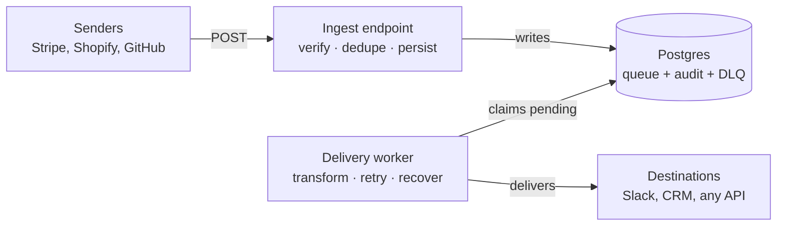

# Webhook Relay & Transformer

A middleman that sits between webhook senders (Stripe, Shopify, GitHub) and wherever you actually want the data to go (Slack, a CRM, some internal API). Its whole job is to make sure a webhook never gets silently lost — not when the destination is down, not when the same event shows up twice, not even when the relay itself crashes halfway through a delivery.

**Live:** https://relay-api-p2pp.onrender.com — `/events` shows what's been received, `/docs` has the interactive API. It's on a free tier, so the first request after it's been idle takes ~40 seconds to wake up. Just give it a moment.

## Why this exists

Most teams point Stripe (or whatever) straight at their own server and call it done. That's fine right up until one of these happens:

- Your server is down for thirty seconds, Stripe fires a webhook during those thirty seconds, and now that event is just gone. The customer paid; they never got the email.
- Stripe sends the same event twice (it does this on purpose, to be safe). If you're not careful you charge-notify the customer twice, or write two records.
- Your process dies mid-request. Did the event get delivered or not? No way to tell after the fact.

The relay fixes all three by refusing to do the delivery inline. When a webhook comes in, it gets written down and acknowledged immediately — that's it. A separate worker handles actually delivering it, retrying when things fail. Receiving and delivering are two different jobs, and keeping them apart is the whole trick.

## How it's put together



The ingest endpoint authenticates the sender, checks it's not a duplicate, writes the event to Postgres, and returns 200 — all in a few milliseconds. It never calls the destination itself. The worker picks up stored events separately and delivers them. Because of that split, a dead or slow destination can't block incoming webhooks or cause one to be dropped.

## The decisions that actually matter

**Postgres is the queue.** No Redis, no RabbitMQ. A single table with `SELECT ... FOR UPDATE SKIP LOCKED` does the job at any volume a webhook relay realistically sees, and it means the queue, the audit log, and the dead-letter pile are all just the same table filtered by a `status` column. `SKIP LOCKED` is what lets two workers run at once without ever grabbing the same row. One less service to run, and no gap between "the queue" and "the record of what happened" — they're literally the same rows.

**At-least-once delivery.** You can't actually guarantee exactly-once in a system where a process might die between "the HTTP call worked" and "I saved that it worked." So you pick your poison. This picks at-least-once — better to occasionally deliver twice than to ever lose one, since for webhooks a silent loss is the worst outcome. The duplicates that result get caught at the front door by a unique constraint on `(source, external_id)`, enforced by Postgres itself, so even two identical webhooks landing in the same millisecond can't both make it in.

**Crash recovery through leases.** When the worker grabs an event it stamps the time and marks it `delivering`. That's a lease, not ownership. If the worker gets `kill -9`'d or the box loses power mid-delivery, nothing cleans up and the row is stuck at `delivering` forever. So every cycle the worker first sweeps for `delivering` rows that have been sitting too long, and throws them back on the queue. Same idea as SQS's visibility timeout. This is the part that makes it survive real crashes and not just tidy errors.

**Backoff lives in the database, not in memory.** A failed delivery writes its next retry time into the row (30s, then 2min, then 10min, then an hour), and the claim query just skips anything not due yet. Kill the worker and restart it — all the retry timing is still there, because it was never in memory to begin with.

**Transforms are config, not code.** Senders and destinations want different shapes. Instead of writing delivery code per destination, there's a JSON template with `{{dotted.path}}` placeholders that get filled from the stored payload. New destination format = new template file. Whole-value placeholders keep their type (a number stays a number, not `"5000"`), and a missing field just comes out blank instead of blowing up.

## Proving it works

Each failure mode does something you can actually watch happen:

- **Destination down** → retries with backoff, then delivers itself once the destination is back, no button-pushing
- **Duplicate** → rejected by the unique constraint, sender gets a calm 200
- **Tampered payload** → HMAC check fails, 401
- **Worker dies mid-delivery** → the lease expires and the event comes back around
- **Gives up after 5 tries** → lands in the dead-letter pile, where you can inspect it and replay by hand

## API

- `POST /hooks/{source}` — take in a webhook (verify, dedupe, store)
- `GET /events?status=failed` — list events, filter by status
- `POST /events/{id}/replay` — put a failed event back on the queue

Replay is deliberately dumb: it just flips a failed event back to `pending` and lets the normal worker pick it up. There's no separate redelivery path. It won't touch anything that isn't `failed` (you get a 409), so you can't accidentally re-send something that already went through.

## Tests

```bash
pytest -v
```

Three tests, covering the things that would actually be embarrassing if they broke: a tampered payload gets rejected, the unique constraint really does stop duplicates at the database level, and a normal signed webhook goes through.

## Stack

Python, FastAPI, Postgres, SQLAlchemy 2.0 (async), asyncpg, Alembic, httpx, Pydantic, Docker. On purpose there's no Redis, no Celery, no broker — the reliability is supposed to come from the design, not from stacking more moving parts.

## Running it locally

```bash
# start just Postgres
docker compose up -d db

# environment
python -m venv .venv && source .venv/bin/activate
pip install -r requirements.txt

# config — copy the example and fill in your own values
cp .env.example .env

# schema
alembic upgrade head

# then run both processes, one per terminal
uvicorn app.main:app --reload
python worker.py
```

Or just bring the whole thing up in containers at once:

```bash
docker compose up --build
```

Config (database URL, signing secret, destination URL) comes from environment variables — see `.env.example`.

## A note on the deployment

It's on Render — a Docker web service plus a managed Postgres.

One thing I'd do differently with a budget: ideally the worker runs as its own separate process, which is exactly how the local `docker-compose.yml` sets it up — API and worker in separate containers so they can fail and scale independently. Render's free tier doesn't do standalone background workers, so in the deployed version the worker runs inside the same container as the API (see `start.sh`). It's a compromise for a free demo, not how I'd ship it for real. Splitting them back apart is already done in the compose file.

## Layout

```
app/
  main.py           ingest + admin endpoints
  models.py         the events table (queue + audit + dead-letter, all in one)
  sources.py        per-sender adapters — signature scheme, where the ID lives
  destinations.py   per-destination URL + which transform to use
  transformer.py    the {{placeholder}} engine
  db.py, config.py  connection + settings
worker.py           the delivery worker
transforms/         JSON templates (config, not code)
tests/              pytest
alembic/            migrations
Dockerfile          one image, API and worker both run from it
docker-compose.yml  full local stack
render.yaml         deploy config
start.sh            container entrypoint
```